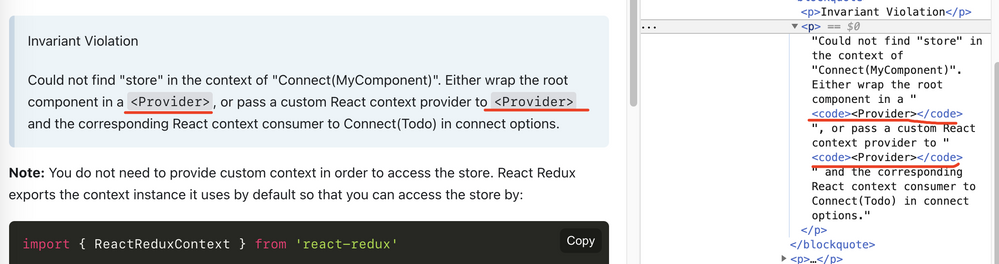
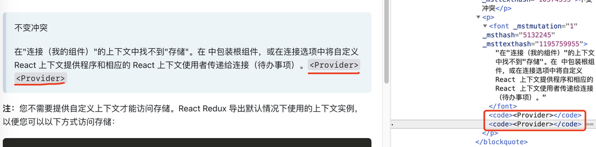

# Fix \<code\> bug for Edge translator

English | [中文](README_zh.md)

- A tampermonkey script: To fix a long-standing bug in Microsoft Edge's built-in translator: it moves all `<code>` tags to the end of the paragraph when translating, resulting in a completely unreadable text paragraph.
- More detailed discussion: [The translator always move the code tag content to the end - Microsoft Community Hub](https://techcommunity.microsoft.com/t5/discussions/the-translator-always-move-the-code-tag-content-to-the-end/m-p/1906043)

- Principle: replace `<code>` with the same styled `` on all pages

> Fuck you, Microsoft! Why hasn't such a pernicious bug been fixed in many years?