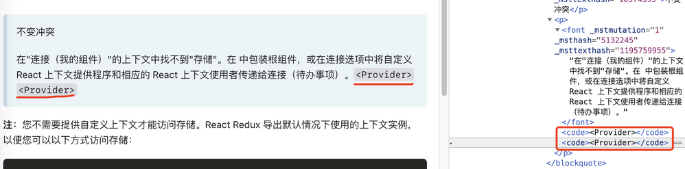

# Fix \<code\> bug for Edge translator

[English](README.md) | 中文

## 介绍

- 一个简单的油猴脚本
- 修复Microsoft Edge长期存在的内置翻译器的bug：在翻译时会把所有`<code>`标签都移动到段落的最后，导致文本段完全不可读
- 具体详见：[The translator always move the code tag content to the end - Microsoft Community Hub](https://techcommunity.microsoft.com/t5/discussions/the-translator-always-move-the-code-tag-content-to-the-end/m-p/1906043)

👇

## 安装

- Greasy Fork: https://greasyfork.org/scripts/485715-fix-code-bug-for-edge-translator

## 说明

- 原理：监听DOM变更，将所有页面中内联的`<code>`替换成同样式的``，再使用内置翻译即可正常工作
- 由于实现原理，在DOM出现大量变更时，可能会导致性能下降
- 此方案绝非完美，在有些网站可能会导致问题，依赖xpath修改元素的javascript代码也会受到影响
- **欢迎在issue报告遇到的问题**

> 这么恶性的BUG为什么几年了还不修？
> Fuck you, Microsoft！